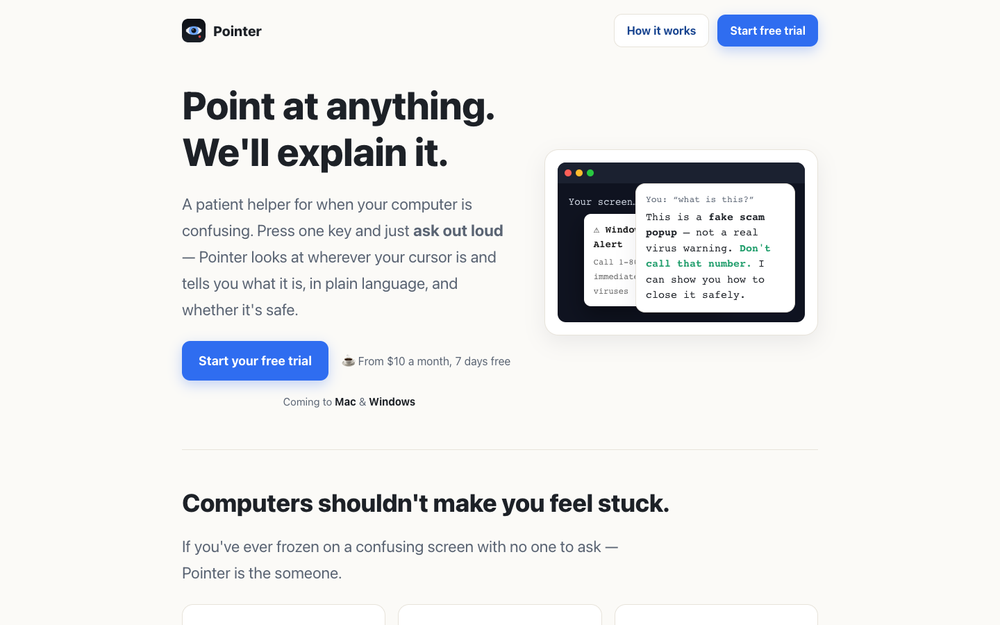

# Pointer

**A Mac desktop-assistance prototype that combines screen context and voice
input to provide low-friction, plain-language guidance.**

From the Pointer product page.

For Mac (Intel & Apple Silicon).

[Download the prototype from Releases](https://github.com/willykeenan/pointer-app/releases).
